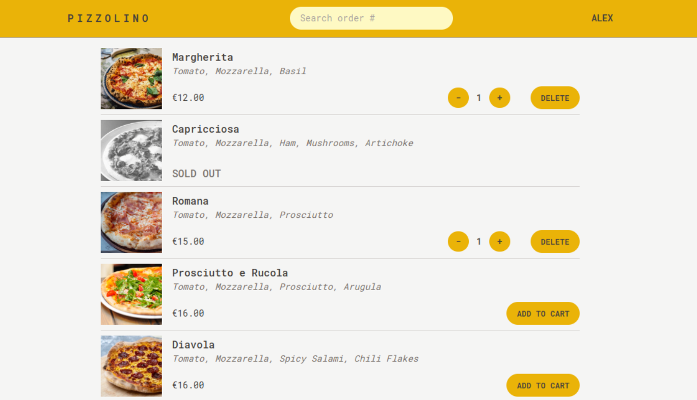
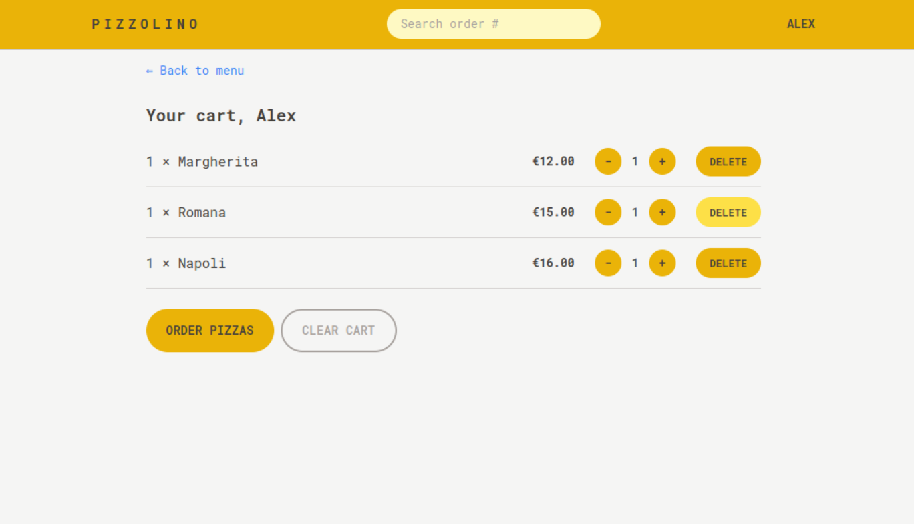
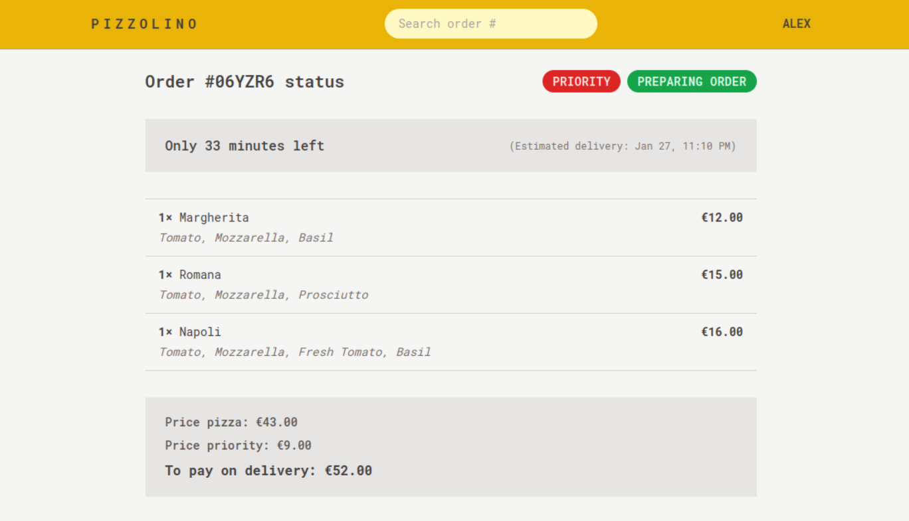

# Pizzolino

The application allows users to order pizza fast requiring no user account and no login.

## Features of App

- User can add multiple pizzas to a cart and make changes before ordering
- User can provide a GPS location to make delivery easier
- User can mark their order 'priority'
- Each order has a unique ID, so the user can later look up their order

## Tech Stack

- React
- React Router
- Redux
- Tailwind CSS
- Vite

### Short demovideo


### Pages





## Setup

Install dependencies and run app

```sh
npm install
npm run dev
```
